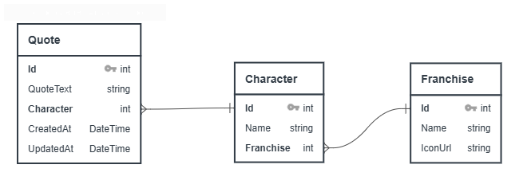

# Boomer.io - Boomer Shooter Quotes API


A lightweight **RESTful API** serving quotes from classic _boomer shooters_ (e.g., **Blood**, **Duke Nukem 3D**), built with **ASP.NET Core** and **SQLite** — with a minimal static frontend for testing.

---

## Features

- 🎯 Random quote endpoint (`/api/Quotes/random`)
- 📜 Full quote list (`/api/Quotes`)
- 🧍 Character and franchise listings
- 🌐 Simple frontend (HTML/JS) to test endpoints
- 🐳 Docker support via Docker Compose
- 📦 SQLite + EF Core migrations for local DB

---

## Tech Stack

- **Backend:** ASP.NET Core 8 Web API
- **ORM:** Entity Framework Core + SQLite
- **Frontend:** Vanilla HTML + JavaScript + CSS (no frameworks)
- **API Docs:** Swagger

## Build database

1. Run the following command to apply migrations and generate the SQLite database:

```bash
dotnet ef database update
```

## Docker

This project includes Docker and Docker Compose support for easy setup and deployment.

### Running with Docker Compose

Make sure you have Docker and Docker Compose installed.

1. Run the containers:

```bash
docker-compose up --build
```

**Url:**

- App running at: [http://localhost:8080](http://localhost:8080)

---

## API Endpoints

| Method | Route                                     | Description                                           |
| ------ | ----------------------------------------- | ----------------------------------------------------- |
| GET    | `/api/Quotes/random`                      | Get a random quote                                    |
| GET    | `/api/Quotes`                             | Get all quotes                                        |
| GET    | `/api/Quotes/{id}`                        | Get quote by ID                                       |
| GET    | `/api/Quotes/character/{idCharacter}`     | Get quotes for a specific character                   |
| GET    | `/api/Quotes/search`                      | Get quotes filtered by a query                        |
| GET    | `/api/Characters`                         | Get all characters                                    |
| GET    | `/api/Characters/{id}`                    | Get character by ID                                   |
| GET    | `/api/Characters/franchise/{idFranchise}` | Get characters filtered by their respective franchise |
| GET    | `/api/Franchises`                         | Get all franchises                                    |
| GET    | `/api/Franchises/{id}`                    | Get franchise by ID                                   |

---

## Running Locally

### Backend (.NET 8):

```bash
cd boomerio
dotnet restore
dotnet run
```

API available at:  
[https://localhost:7239](https://localhost:7239)

---

### Frontend (Static HTML/JS):

Open `/frontend/index.html` directly in your browser.

Or serve via:

```bash
npx serve frontend
```

---

## Database

- **SQLite** (LocalDB or full version)
- Database auto-generated via Entity Framework migrations

### Schema Overview

**Quote**

- `Id`
- `QuoteText`
- `CharacterId` (FK)
- `CreatedAt`
- `UpdatedAt`

**Character**

- `Id`
- `Name`
- `FranchiseId` (FK)

**Franchise**

- `Id`
- `Name`
- `IconUrl`

### Database Diagram



---

## Testing

- Manual testing via **Insomnia**
- Unit testing using xUnit

---

## Future Plans

- [x] Add Unit Tests (xUnit)
- [ ] Implement integration tests to ensure end-to-end API functionality and reliability
- [ ] Deploy backend to Azure / Railway
- [ ] Host static frontend (GitHub Pages / Vercel)

---

## About

Inspired by classic 90's shooters — a tribute to **Duke Nukem**, **Blood**, **Serious Sam** and more.

Made with love by Luis.
